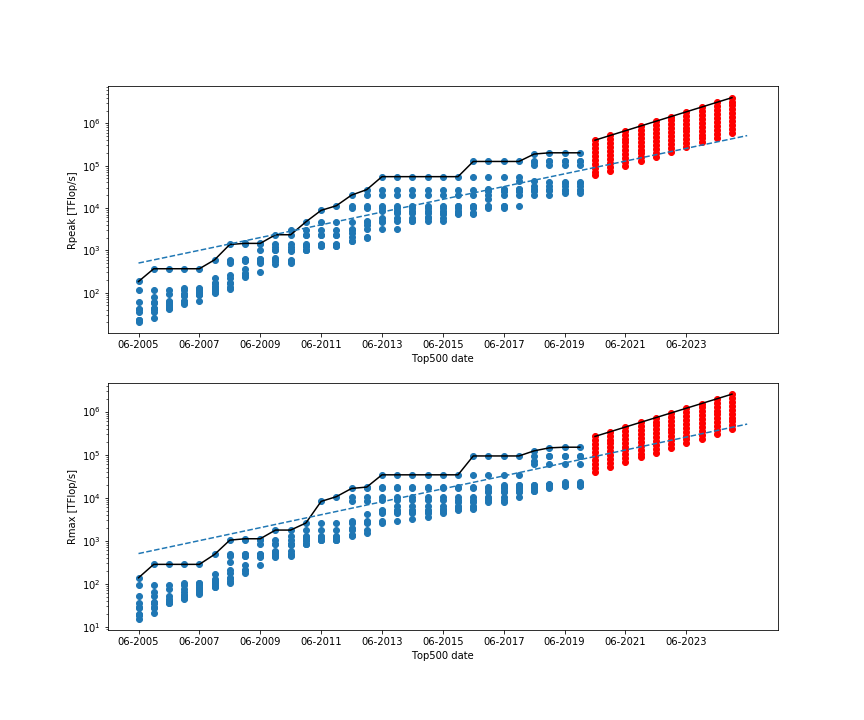

# TOP500
Analyse of the top500.org site for ML predictions.


## Guidelines

On the top500.org site, we can find the ranks and details of the 500 most powerful supercomputers in the world.

To start, have a look at the most recent list and briefly comment on the following question:
 - What manufacturers produce the world's largest supercomputers?
 - What types of processors do they use?
 - What fraction of peak performance is typically achieved for the LINPACK benchmark?

Then, the work to do is:
- Export all the lists (xls format) from 2005 to 2020
- Preprocess your data (clean up, )
- Build a ML model to predict Rpeak, Rmax, Total number of cores and Core speed for the 5 next years
- Discuss results with respect to the Moore Law


## Data

- ### TOP500 dataset

Downloaded from the Top500 website, two lists per years from 2005 to 2019.

Link : https://www.top500.org/


## Explanation

The python notebook `top500-Multi-Podium.ipynb` is divided into 2 parts following the guidelines.
The second one, is ruled by the variable *head_num* that describes the number of best computers to use for predictions.


## Results

```python
head_num = 10
```



## Python libraries

os, sys, xlrd, Pandas, Numpy, seaborn, matplotlib, scikit-learn
